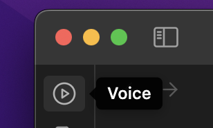
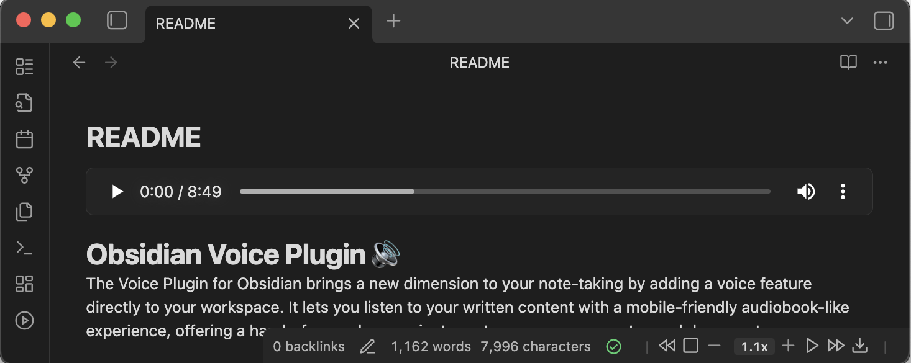
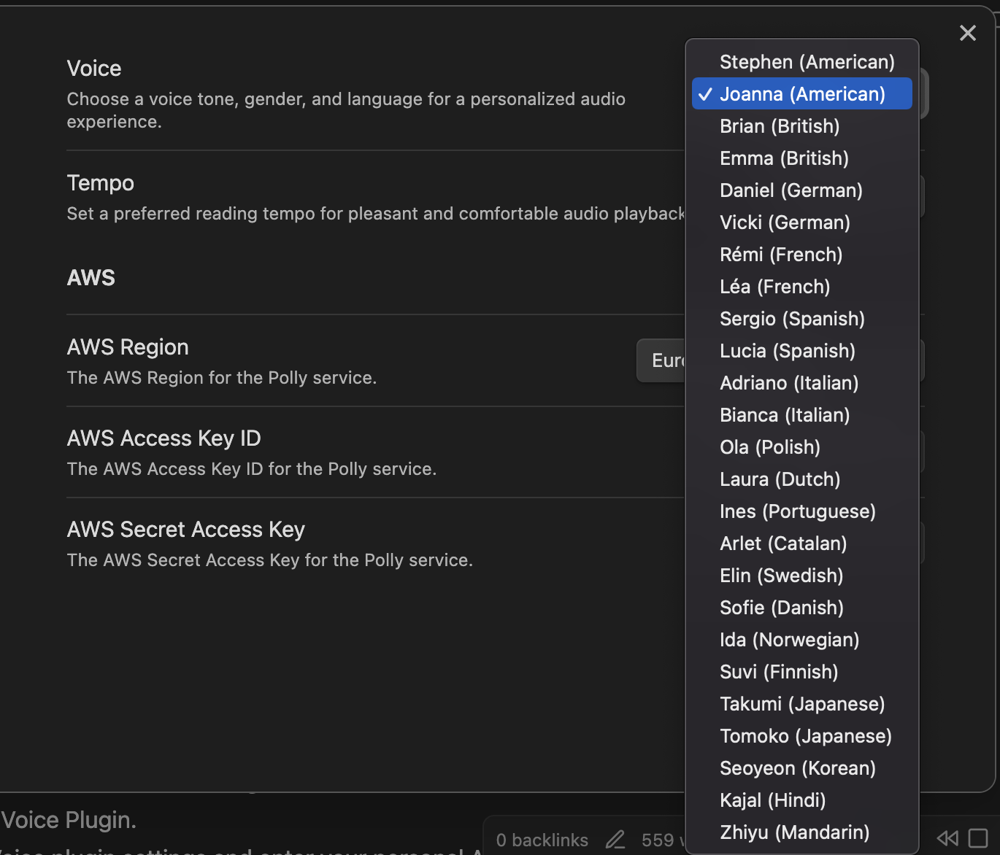
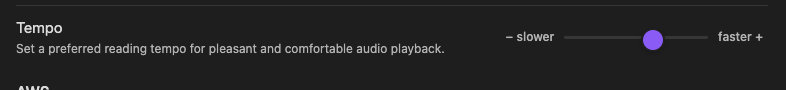
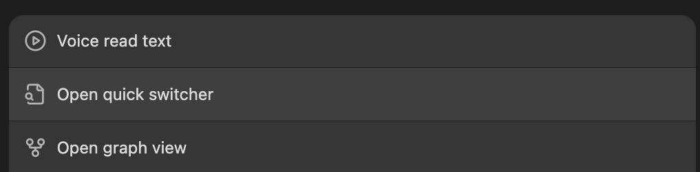
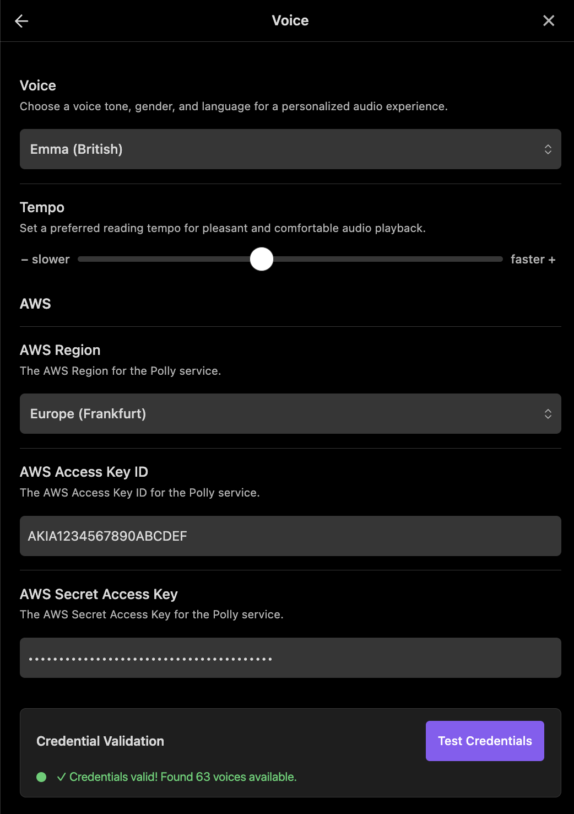
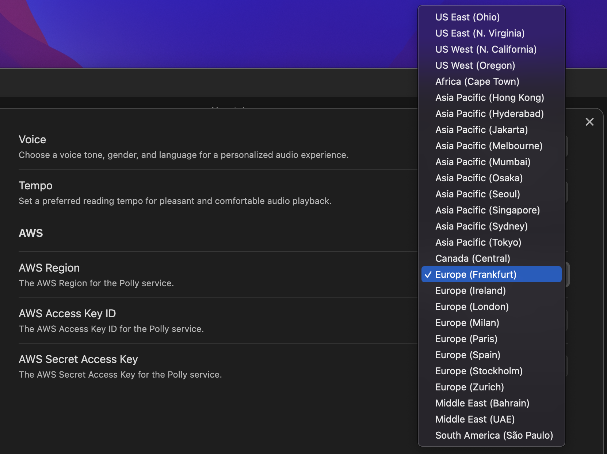
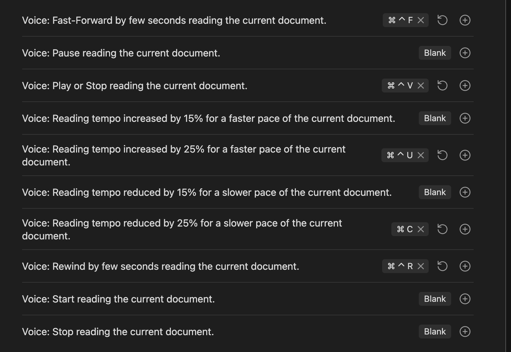

# Obsidian Voice Plugin 🔊

Turn every note into a mobile-friendly, audiobook-like experience. The Obsidian Voice Plugin adds natural speech, intuitive audio controls, and secure AWS Polly integration so you can listen to your workspace anywhere.

## Table of Contents

- [Quick Overview](#quick-overview)
- [Feature Tour](#feature-tour)
- [Getting Started](#getting-started)
- [Setting Up AWS Access](#setting-up-aws-access)

## Quick Overview

- **Listen in seconds**: Convert any note—or a highlighted selection—into lifelike speech using your own AWS account for full privacy.
- **Designed for every device**: Enjoy the same experience on desktop, iOS, and Android with dedicated mobile controls.
- **Own your audio**: Download MP3 files, auto-embed them back into your note, and keep an offline archive.
- **Stay in control**: Adjust tempo on the fly, jump forward or back, and watch synthesis progress in real time.

## Feature Tour

### Listen Instantly

- Launch playback from the left-hand **Voice** ribbon icon whenever you need it.

  

- Leverage 25 neural-quality AWS Polly voices across 18 languages while keeping your data within your AWS account.
- If the voice control bar turns red, an error banner appears (e.g., after a network issue); everything resets automatically so you can retry immediately.

  

### Save & Play Audio Offline

- While playback is running, hit the control bar download button to grab an MP3 named after your note; the plugin automatically embeds it right after the front matter to be played at your convenience and offline.

  

- Cached audio prevents repeat synth costs until your note content changes.

### Precision Playback Controls

- Track synthesis loading with the real-time status bar progress bar until voice playback is ready.

  

- Use rewind/fast-forward controls and on-the-fly tempo changes for quick navigation.

### Personalize the Voice

- Choose regional pronunciations from American, British, German, French, Spanish, Italian, Polish, Dutch, Portuguese, Catalan, Swedish, Danish, Norwegian, Finnish, Japanese, Korean, Hindi, or Mandarin.

  

- Adjust speech speed from 0.5x to 2x without leaving the status bar.

  

### Built for Mobile

- Launch playback on the Obsidian mobile app via the dedicated Voice menu item.

  

- Control playback with the touch-friendly mobile control bar—play/pause, rewind, fast-forward, tempo, and a progress indicator included.

  

- Update credentials, validate regions, and check voice availability directly from mobile settings.

  

### Smart Content Handling

- Default playback reads the entire note; in Source mode, the plugin speaks only the text you select.
- Markdown pre-processing cleans, enhances, and chunks content for reliable AWS Polly delivery.
- Regional configuration lets you pick the AWS region closest to you for lower latency.

  

### Hands-Free Shortcuts

- Assign hotkeys to start, stop, pause, rewind, fast-forward, or change tempo without leaving the keyboard.

  

> **Heads-up**: Large notes may take a moment to process. The ribbon icon shows a refresh indicator while synthesizing and flips to a pause icon when playback is ready.

## Getting Started

1. Install the Voice plugin inside Obsidian (Community Plugins → Browse → Voice).
2. Toggle the plugin on.
3. Open **Settings → Voice** and enter your AWS region, Access Key ID, and Secret Access Key.
4. Open any note and press the Voice ribbon icon or your preferred hotkey to start listening.
5. If not working, try to restart Obsidian.

> **No AWS account yet?** Create one free at [aws.amazon.com](https://aws.amazon.com/). The AWS Free Tier includes 1 million neural characters per month for the first 12 months.

## Setting Up AWS Access

Create a dedicated AWS Identity and Access Management (IAM) user so the plugin can call Polly without exposing your primary credentials.

### Step-by-Step

1. Sign in to the AWS Management Console and open **IAM**.
2. Choose **Users → Add users** and set a name such as `obsidian-voice-plugin`.
3. Select **Access key - Programmatic access**.
4. Grant permissions using one of the options below.

#### Option A: Fastest Setup (Recommended)

- Choose **Attach existing policies directly**.
- Search for and select **AmazonPollyReadOnlyAccess**.

#### Option B: Minimal Permissions

- Click **Create policy → JSON** and paste the policy below.
  ```json
  {
    "Version": "2012-10-17",
    "Statement": [
      {
        "Effect": "Allow",
        "Action": ["polly:SynthesizeSpeech", "polly:DescribeVoices"],
        "Resource": "*"
      }
    ]
  }
  ```
- Save it as `ObsidianVoiceMinimalAccess`, return to the user wizard, and attach the policy.

5. Complete the user creation, then copy the **Access Key ID** and **Secret Access Key** once they appear.
6. Paste those values into **Settings → Voice** in Obsidian, choose your AWS region, and save.

You’re ready to listen! If you ever rotate keys, just update the credentials in settings—no reinstall required.
