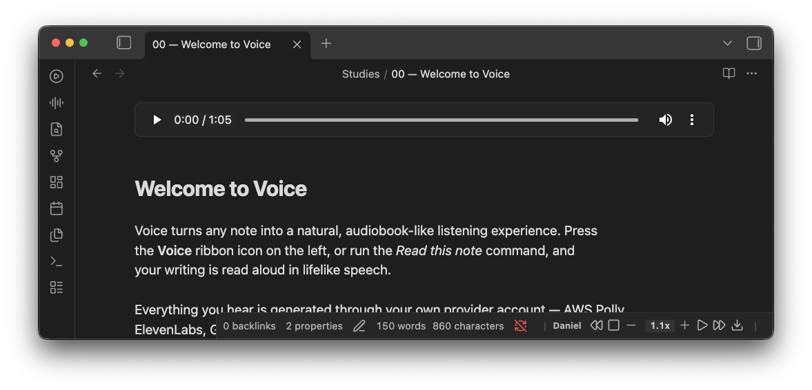
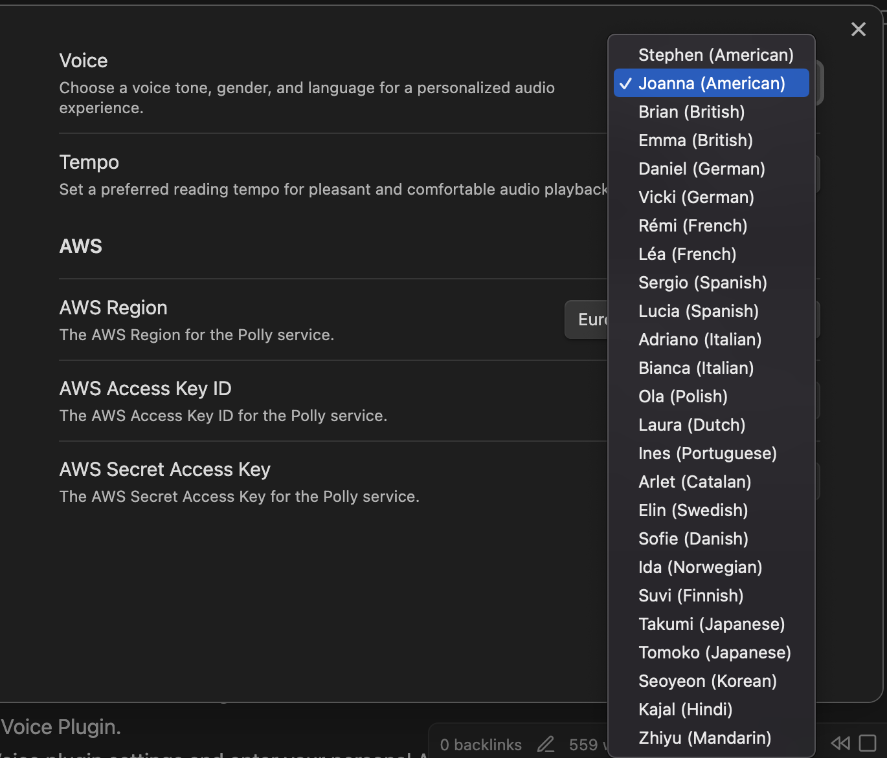
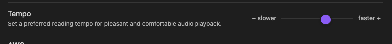
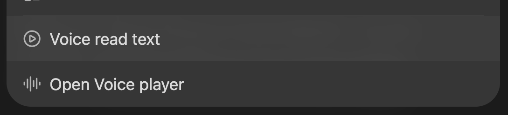
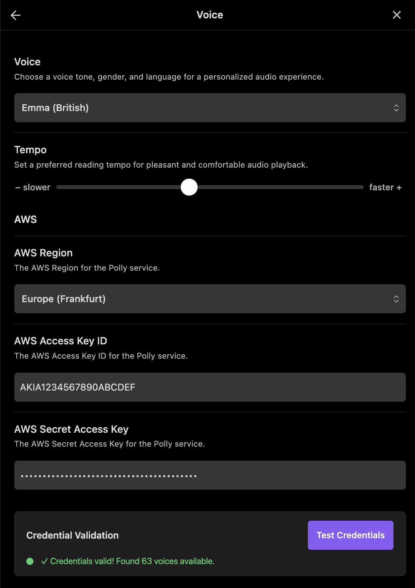
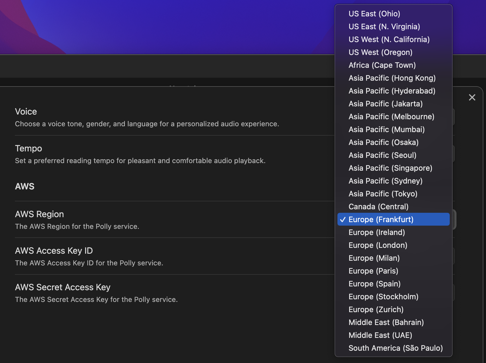
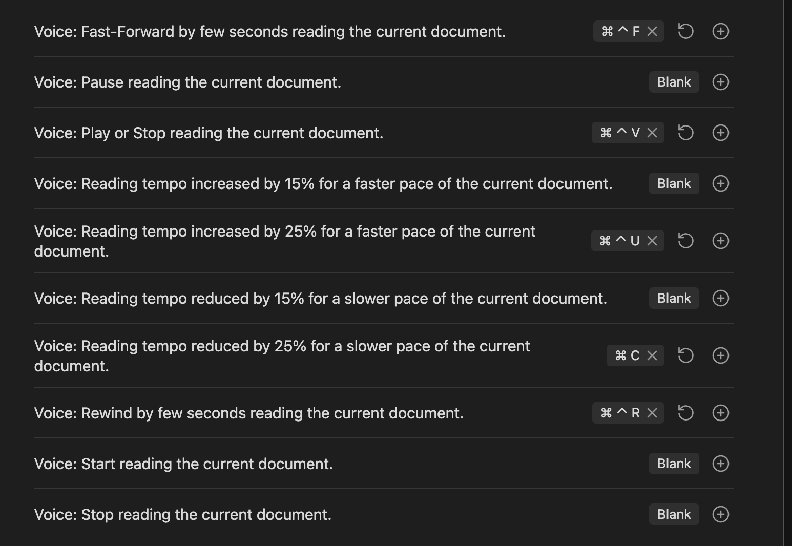

# Obsidian Voice Plugin 🔊

Turn every note into a mobile-friendly, audiobook-like experience. The Obsidian Voice Plugin reads your notes aloud in natural, lifelike speech — powered by your choice of **AWS Polly** or **ElevenLabs**. Same controls, downloads, and content options on every device, with credentials kept private in your own account.

## Table of Contents

- [Highlights](#highlights)
- [Choose Your Speech Provider](#choose-your-speech-provider)
- [Feature Tour](#feature-tour)
- [Getting Started](#getting-started)
- [Setting Up AWS Polly](#setting-up-aws-polly)
- [Setting Up ElevenLabs](#setting-up-elevenlabs)

## Highlights

- **Two engines, one experience**: Switch between **AWS Polly** and **ElevenLabs** anytime. Every feature below works the same for both.
- **Listen in seconds**: Convert any note—or a highlighted selection—into lifelike speech.
- **Designed for every device**: Enjoy the same experience on desktop, iOS, and Android with dedicated mobile controls.
- **Own your audio**: Download MP3 files, auto-embed them back into your note, and keep an offline archive.
- **Stay in control**: Adjust tempo on the fly, jump forward or back, and watch synthesis progress in real time.
- **Stay private**: Your credentials live in your own AWS or ElevenLabs account—nothing is routed through a third party.

## Choose Your Speech Provider

Pick **AWS Polly** or **ElevenLabs** from the **Speech Provider** dropdown in settings. Each provider keeps its own credentials and voice list; everything else—tempo, downloads, auto-save, and the content toggles—works identically. After entering your credentials, press **Test Credentials** to confirm everything is connected.

|                 | **AWS Polly**                                                   | **ElevenLabs**                                                                     |
| --------------- | --------------------------------------------------------------- | ---------------------------------------------------------------------------------- |
| **Voices**      | 28 neural voices across 19 languages                            | 7 premade voices, multilingual models speak 29 languages                           |
| **Credentials** | AWS region + Access Key ID & Secret                             | ElevenLabs API key                                                                 |
| **Emphasis**    | SSML pauses and emphasis (louder headings/bold, softer italics) | Expressive models with natural `<break>` pauses at headings, paragraphs, and lists |
| **Models**      | Neural engine                                                   | Multilingual v2 (quality), Flash v2.5 (fastest), Turbo v2.5 (balanced)             |

## Feature Tour

### Listen Instantly

- Launch playback from the left-hand **Voice** ribbon icon whenever you need it.

  

- Choose from 28 neural-quality AWS Polly voices across 19 languages, or ElevenLabs' expressive multilingual voices.
- If the voice control bar turns red, an error banner appears (e.g., after a network issue); everything resets automatically so you can retry immediately.

  

### Save & Play Audio Offline

- While playback is running, hit the control bar download button to grab an MP3 named after your note; the plugin embeds it right after the front matter so you can replay it anytime, offline.

  

- Prefer a hands-off workflow? Enable **Auto-Save Audio to Note** in settings to save and embed the MP3 automatically after every successful playback—no manual download click. Off by default.

- Cached audio prevents repeat synthesis costs until your note content changes.

### Precision Playback Controls

- Track synthesis loading with the real-time status bar progress indicator until playback is ready.

  

- Use rewind/fast-forward controls and on-the-fly tempo changes for quick navigation.

### Personalize the Voice

- Choose regional pronunciations from American, British, German, French, Spanish, Italian, Polish, Dutch, Portuguese, Brazilian Portuguese, Catalan, Swedish, Danish, Norwegian, Finnish, Japanese, Korean, Hindi, or Mandarin.

  

- Adjust speech speed from 0.5x to 1.9x without leaving the status bar.

  

### Fine-Tune What Gets Spoken

These content toggles apply to both providers and are all **off by default**:

- **Spell Out Acronyms** — Enable to read uppercase words like `NASA` or `API` letter by letter. Off means they are pronounced naturally. (Applies to AWS Polly.)
- **Read Code Blocks** — Enable to read fenced code blocks (Mermaid, YAML, and other code) aloud. Off announces them with a short placeholder instead.
- **Skip Website URLs** — Enable to strip website URLs (`https://…` and `www.…`) from the spoken output while keeping the surrounding text and link labels intact. Off reads them as written.
- **Auto-Save Audio to Note** — Enable to automatically save and embed the MP3 after each successful playback (see [Save & Play Audio Offline](#save--play-audio-offline)).

### Built for Mobile

- Launch playback on the Obsidian mobile app via the dedicated Voice menu item.

  

- Control playback with the touch-friendly mobile control bar—play/pause, rewind, fast-forward, tempo, and a progress indicator included.

  

- Update credentials, validate your setup, and check voice availability directly from mobile settings.

  

### Smart Content Handling

- Default playback reads the entire note; in Source mode, the plugin speaks only the text you select.
- Markdown pre-processing cleans, enhances, and chunks content for reliable delivery.
- For AWS Polly, pick the region closest to you for lower latency.

  

### Hands-Free Shortcuts

- Assign hotkeys to start, stop, pause, rewind, fast-forward, or change tempo without leaving the keyboard.

  

> **Heads-up**: Large notes may take a moment to process. The ribbon icon shows a refresh indicator while synthesizing and flips to a pause icon when playback is ready.

## Getting Started

1. Install the Voice plugin inside Obsidian (Community Plugins → Browse → Voice) and toggle it on.
2. Open **Settings → Voice** and pick your **Speech Provider** (AWS Polly or ElevenLabs).
3. Enter that provider's credentials (see [Setting Up AWS Polly](#setting-up-aws-polly) or [Setting Up ElevenLabs](#setting-up-elevenlabs)) and press **Test Credentials**.
4. Open any note and press the Voice ribbon icon or your preferred hotkey to start listening.
5. If it's not working, try restarting Obsidian.

## Setting Up AWS Polly

> **No AWS account yet?** Create one free at [aws.amazon.com](https://aws.amazon.com/). The AWS Free Tier includes 1 million neural characters per month for the first 12 months.

Create a dedicated AWS Identity and Access Management (IAM) user so the plugin can call Polly without exposing your primary credentials.

1. Sign in to the AWS Management Console and open **IAM**.
2. Choose **Users → Add users** and set a name such as `obsidian-voice-plugin`.
3. Select **Access key - Programmatic access**.
4. Grant permissions using one of the options below.

   **Option A — Fastest Setup (Recommended):** Choose **Attach existing policies directly** and select **AmazonPollyReadOnlyAccess**.

   **Option B — Minimal Permissions:** Click **Create policy → JSON**, paste the policy below, save it as `ObsidianVoiceMinimalAccess`, then attach it to the user.

   ```json
   {
     "Version": "2012-10-17",
     "Statement": [
       {
         "Effect": "Allow",
         "Action": ["polly:SynthesizeSpeech", "polly:DescribeVoices"],
         "Resource": "*"
       }
     ]
   }
   ```

5. Complete the user creation, then copy the **Access Key ID** and **Secret Access Key** once they appear.
6. In **Settings → Voice**, choose **AWS Polly**, select your region, paste both keys, and press **Test Credentials**.

If you ever rotate keys, just update the credentials in settings—no reinstall required.

## Setting Up ElevenLabs

1. Sign in at [elevenlabs.io](https://elevenlabs.io/) and open **Settings → API Keys**.
2. Create a key and copy it.
3. In **Settings → Voice**, choose **ElevenLabs**, pick a model (Multilingual v2 for quality, Flash v2.5 for speed, or Turbo v2.5 for a balance) and a voice.
4. Paste your API key and press **Test Credentials**.

You're ready to listen!
