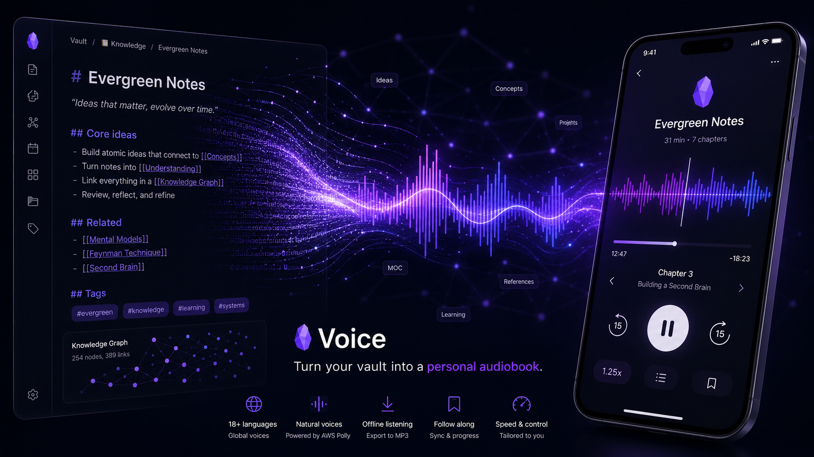
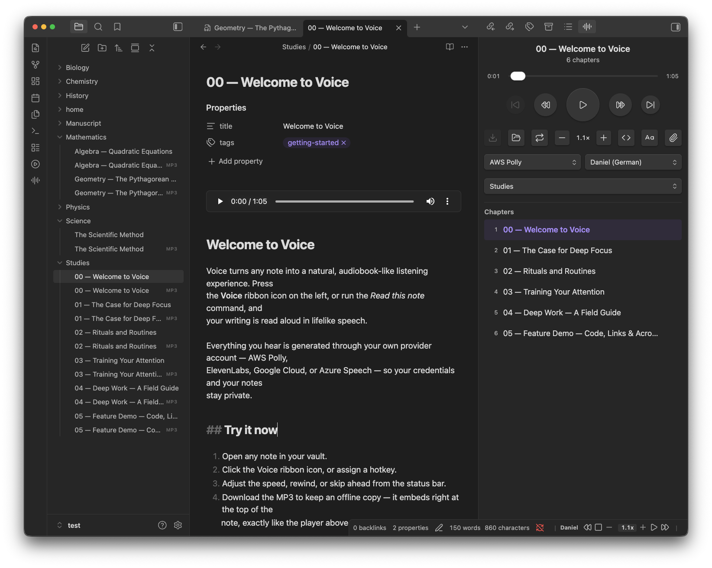
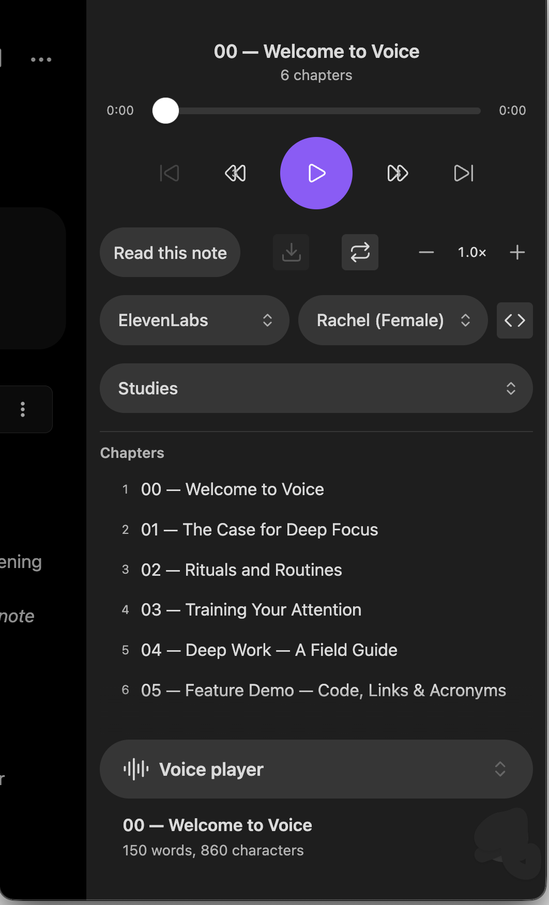
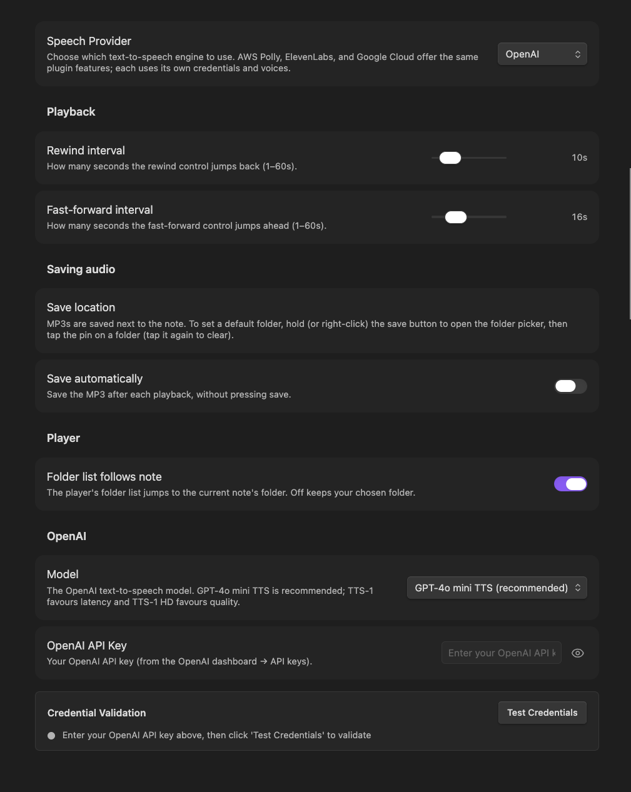

# Obsidian Voice Plugin 🔊

Turn every note into a mobile-friendly, audiobook-like experience. The Obsidian Voice Plugin reads your notes aloud in natural, lifelike speech — using the text-to-speech provider you already have. It supports all the major engines — **AWS Polly**, **ElevenLabs**, **OpenAI**, **Google Cloud**, and **Azure Speech** — so you can listen with whichever one you prefer. Listen with a dedicated player, jump between notes like chapters, change the speed on the fly, and save audio offline — with your credentials kept private in your own account.

## Table of Contents

- [Highlights](#highlights)
- [The Voice Player](#the-voice-player)
- [Feature Tour](#feature-tour)
- [Settings](#settings)
- [Keyboard Shortcuts](#keyboard-shortcuts)
- [Bring Your Own Provider](#bring-your-own-provider)
- [Getting Started](#getting-started)
- [Connecting a Provider](#connecting-a-provider)
- [Troubleshooting & Help](#troubleshooting--help)

## Highlights

- **A real audiobook player** — open the Voice player, see your notes as chapters, and play, skip, and repeat just like a podcast app.
- **Bring your own provider** — Voice supports all the major text-to-speech engines (**AWS Polly**, **ElevenLabs**, **OpenAI**, **Google Cloud**, and **Azure Speech**), so you can listen with whichever one you already use. Every feature works the same on all of them.
- **Listen in seconds** — turn any note into lifelike speech straight from the ribbon, a command, or the player.
- **Designed for every device** — the same experience on desktop, iOS, and Android, with a touch-friendly mobile player and control bar.
- **Own your audio** — download MP3 files, auto-embed them into your note, and keep an offline archive.
- **Stay in control** — adjust tempo on the fly, jump forward or back, repeat a chapter or the whole list, and watch synthesis progress in real time.
- **Stay private** — your credentials live in your own provider account; nothing is routed through a third party.

## The Voice Player

The Voice player is the heart of the plugin: an audiobook-style pane that turns your notes into chapters you can listen to back to back. It's docked in the right sidebar (next to Backlinks and Outline) right after install — open it from the audio-waveform ribbon icon — and on mobile it opens full-screen.

#### Controls at a glance

Every control is a single button. Some do **two things**: a quick **tap** and a **press & hold** (~1.5 s; right-click works too on desktop). A ring fills around a button while you hold it.

| Button                                        | Tap                                                              | Press & hold                                                            |
| --------------------------------------------- | ---------------------------------------------------------------- | ----------------------------------------------------------------------- |
| ▶️ **Play**                                   | Play, pause, or cancel a synthesis that's running                | **Regenerate** the note from scratch with your current voice & settings |
| ⏮ ⏭ **Prev / next**                         | Jump to the previous / next chapter                              | —                                                                       |
| ⏪ ⏩ **Rewind / forward**                    | Jump back / ahead by your interval (default 3 s)                 | —                                                                       |
| 🔁 **Repeat**                                 | Cycle _off → repeat one → repeat all_                            | —                                                                       |
| **− / +** **Speed**                           | Slow down / speed up playback (0.5×–2.0×)                        | —                                                                       |
| ⬇️ **Save** (💾 when a default folder is set) | Save the MP3 now — next to the note, or into your default folder | Open the **folder picker** to save elsewhere or set a default           |
| 📂 **Folder**                                 | Save into a folder you pick, in one click                        | —                                                                       |
| `</>` **Read code blocks**                    | Toggle reading fenced code aloud                                 | —                                                                       |
| `Aa` **Spell out acronyms**                   | Toggle reading `NASA`, `API` letter by letter                    | —                                                                       |
| 🔗 **Skip website URLs**                      | Toggle dropping URLs (link labels are kept)                      | —                                                                       |
| 📎 **Embed in note**                          | Toggle adding an audio player to the note when you save          | —                                                                       |
| ⋮ **Track menu**                              | Open **Move / Rename / Delete** for that chapter                 | —                                                                       |

Each toggle (`</>` `Aa` 🔗 📎) **highlights when it's on**, so you can see your reading options at a glance — no trip to settings.

> **Jumping between notes?** By default a tap on ▶️ plays the note you're viewing — its already-saved MP3 if one exists, otherwise a fresh render — so you don't re-generate audio you already saved. Turn this off with **Play the note's saved audio** in settings.

Above the chapter list sit the **provider** and **voice** dropdowns (switch engine or voice instantly) and a **folder dropdown** that points the chapter list at any folder in your vault that contains audio.

- **Chapters from your folder** — every MP3 in the selected folder appears as a numbered chapter; the one you're hearing is highlighted. The folder list follows the note you're viewing by default — turn off **Folder list follows note** in settings to keep your chosen folder while you browse.
- **Manage tracks** — the **⋮** action bar appears right over the track, so it's clear which file it acts on. **Move** opens the folder picker for that file, **Rename** edits it in place (`.mp3` kept, embeds updated), and **Delete** asks for a quick confirmation.

On mobile, the same player opens as a full-screen pane, optimized for touch:

> **Tip:** Open the player from the **Open Voice player** ribbon icon (the audio-waveform icon) or the **Open the player.** command.

## Feature Tour

### Listen Instantly

- Start playback from the left-hand **Voice** ribbon icon (**Voice read text**) whenever you need it.

  

- Default playback reads the entire note. In Source mode, select text first and only your selection is read.
- The ribbon icon shows a refresh indicator while synthesizing and flips to a pause icon when playback is ready.

### Save & Play Audio Offline

The **save button** (the download arrow ⬇, in the player, the status bar, and the mobile bar) writes the current audio to an MP3, embeds it right after the front matter, and adds it to the chapter list — so you can replay it anytime, offline. It has **two gestures**:

- 👆 **Tap** → save now. By default the MP3 lands **next to your note**. If you've set a **default folder**, every tap saves there instead.
- ✋ **Press and hold ~1.5 seconds** (or right-click on desktop) → open the **folder picker** to save somewhere else just this once — or to set your default folder.

In the Voice player there's also a dedicated **folder button** (📂, next to the download arrow): one click opens the folder picker and saves to the folder you choose — a quick **Save to custom folder** without the long press.

**Set a default folder (optional).** In the folder picker, every folder row has a **pin** 📌 and a **star** ⭐:

- 📌 **Pin** → make this folder your default. From now on a quick tap of the save button always saves here. Only one default at a time — tap the pin again to clear it (back to “next to the note”). The default is shown first and highlighted.
- ⭐ **Star** → keep a folder near the top as a favorite. Favorites and the default are managed independently.
- Start typing to filter the list, or to **create a new folder** on the spot.

> **Example.** You keep recordings in `Media/Audio`. Hold the save button, then tap the **pin 📌** next to `Media/Audio`. Done — now a single tap of the save button always stores there. Need to drop one file elsewhere? Hold again and tap a different folder; your default stays put.

**Save or move, your choice.** When you pick a folder in the picker:

- If the audio hasn't been saved yet, it's **saved** into that folder.
- If you loaded an existing recording (a **chapter** in the player), that file is **moved** into the folder — no duplicate, and its embeds are updated automatically.
- If a file with the same name is already there, a prompt lets you **Replace**, **Save as new** (a different name), or **Cancel**.

> **Tip:** When a default folder is set, the save button shows a **floppy-disk** icon (💾) — in the player, the status bar, and the mobile bar — so you can tell at a glance that a tap saves into your default folder rather than next to the note.

- Prefer a hands-off workflow? Turn on **Save automatically** in settings to save and embed after every playback (it uses your default folder too).
- Cached audio prevents repeat synthesis costs until your note content changes.

### Precision Playback Controls

- Track synthesis progress with the real-time status bar indicator until playback is ready.

  

- Use rewind / fast-forward controls and on-the-fly tempo changes for quick navigation.
- Set how far rewind and fast-forward jump — configure each independently from 1 to 60 seconds in settings (defaults to 3 seconds).
- Adjust speech speed from 0.5× to 1.9× without leaving the status bar.

  

### Personalize the Voice

- Choose from dozens of natural voices across many languages — American, British, German, French, Spanish, Italian, Polish, Dutch, Portuguese, Brazilian Portuguese, Catalan, Swedish, Danish, Norwegian, Finnish, Japanese, Korean, Hindi, Mandarin, and more.

  

- Switch voices instantly from the status bar, or use the **Switch to the next speaker.** command to cycle through them hands-free.

### Fine-Tune What Gets Spoken

Flip these as **one-click icon toggles in the Voice player** — they light up when on. All are **off by default** and apply to every provider:

- `</>` **Read code blocks** — read fenced code blocks (Mermaid, YAML, and other code) aloud. Off announces them with a short placeholder instead.
- `Aa` **Spell out acronyms** — read uppercase words like `NASA` or `API` letter by letter. Off pronounces them naturally. (Applies to AWS Polly.)
- 🔗 **Skip website URLs** — strip website URLs (`https://…` and `www.…`) from the spoken output while keeping the surrounding text and link labels intact. Off reads them as written.
- 📎 **Embed MP3 in note** — add an audio player to the note whenever you save its MP3. Off saves the file without embedding.

> **Tip:** prefer a hands-off archive? Turn on **Save automatically** in settings to save and embed after every playback — see [Save & Play Audio Offline](#save--play-audio-offline).

### Built for Mobile

- On the Obsidian mobile app, start playback or open the player from the dedicated **Voice read text** and **Open Voice player** menu items.

  

- Control playback with the touch-friendly mobile control bar — play / pause, rewind, fast-forward, voice switching, tempo, and a progress indicator. (It stays out of the way while the full player is open.)

  

- Update credentials, validate your setup, and check voice availability directly from mobile settings.

  

### Smart Content Handling

- Markdown pre-processing cleans, enhances, and chunks content for reliable delivery.
- Headings, bold text, and pauses are emphasized natively on providers that support SSML (AWS Polly, Google Cloud, Azure Speech).

## Settings

Configure your provider and credentials in **Settings → Voice**. The settings tab stays lean: it covers setup and defaults, while the things you change while listening — **voice**, **tempo**, and the **content toggles** (read code blocks, spell out acronyms, skip website URLs, embed MP3) — live as one-click controls in the Voice player.

| Setting                         | What it does                                                                                                                                                                                                                                                                              |
| ------------------------------- | ----------------------------------------------------------------------------------------------------------------------------------------------------------------------------------------------------------------------------------------------------------------------------------------- |
| **Speech Provider**             | Choose the engine: **AWS Polly**, **ElevenLabs**, **Google Cloud**, **Azure Speech**, or **OpenAI**. The credential fields below adapt to your choice.                                                                                                                                    |
| **Rewind interval**             | How many seconds the rewind control jumps back (1–60s, default 3s).                                                                                                                                                                                                                       |
| **Fast-forward interval**       | How many seconds the fast-forward control jumps ahead (1–60s, default 3s).                                                                                                                                                                                                                |
| **Save automatically**          | Automatically save and embed the MP3 after each playback. Off by default.                                                                                                                                                                                                                 |
| **Save location**               | Where saved MP3s go. Next to the note by default. Hold the save button to open the folder picker, then pin (📌) a folder as your default; tap the pin again to clear it. Star (⭐) folders for quick access.                                                                              |
| **Folder list follows note**    | Player's folder picker auto-switches to the folder of the note you're viewing. On by default; turn off to keep your chosen folder.                                                                                                                                                        |
| **Play the note's saved audio** | On play, load the MP3 already saved for the note you're viewing (matched by name) instead of re-generating it — so jumping between notes picks up each note's audio, even with another chapter loaded. On by default; turn off to keep the loaded chapter playing and always re-generate. |
| **Test Credentials**            | Validate your provider keys; on success it reports how many voices are available.                                                                                                                                                                                                         |

## Keyboard Shortcuts

Voice ships **16 commands** you can bind to any hotkey. No keys are assigned by default — open **Settings → Hotkeys**, search for **Voice**, and assign whatever feels natural. (In the command palette, each command is prefixed with **Voice:**.)

| Command                                                                   | What it does                             |
| ------------------------------------------------------------------------- | ---------------------------------------- |
| Start reading the current document.                                       | Begin reading the active note            |
| Play or Stop reading the current document.                                | Toggle playback with one key             |
| Pause reading the current document.                                       | Pause playback                           |
| Stop reading the current document.                                        | Stop playback and reset                  |
| Rewind by few seconds reading the current document.                       | Jump back by your rewind interval        |
| Fast-Forward by few seconds reading the current document.                 | Jump ahead by your fast-forward interval |
| Increase the reading speed by 0.1x.                                       | Speed up playback                        |
| Decrease the reading speed by 0.1x.                                       | Slow down playback                       |
| Reading tempo increased by 15% for a faster pace of the current document. | Read at 1.15×                            |
| Reading tempo increased by 25% for a faster pace of the current document. | Read at 1.25×                            |
| Reading tempo reduced by 15% for a slower pace of the current document.   | Read at 0.85×                            |
| Reading tempo reduced by 25% for a slower pace of the current document.   | Read at 0.75×                            |
| Save the current audio as an MP3 and embed it in the note.                | Download and embed the audio             |
| Switch to the next speaker.                                               | Cycle to the next voice                  |
| Open the player.                                                          | Open the Voice player pane               |
| Show what's new.                                                          | Reopen the latest "What's New" note      |

## Bring Your Own Provider

Voice is built to work with the provider you already use. For a long time it was AWS Polly only — the goal now is to support all the common text-to-speech engines, so you can bring your own. Pick **AWS Polly**, **ElevenLabs**, **OpenAI**, **Google Cloud**, or **Azure Speech** from the **Speech Provider** dropdown in settings. Each provider keeps its own credentials and voice list; everything else — tempo, rewind/fast-forward intervals, downloads, auto-save, and the content toggles — works identically. After entering your credentials, press **Test Credentials** to confirm everything is connected.

|                 | **AWS Polly**                       | **ElevenLabs**                                      | **Google Cloud**                                  | **Azure Speech**                    | **OpenAI**                                    |
| --------------- | ----------------------------------- | --------------------------------------------------- | ------------------------------------------------- | ----------------------------------- | --------------------------------------------- |
| **Voices**      | Neural voices across many languages | Premade & multilingual voices speaking 29 languages | Neural2 & WaveNet voices across many languages    | Neural voices across many languages | Built-in multilingual voices (Alloy, Nova, …) |
| **Credentials** | AWS region + Access Key ID & Secret | ElevenLabs API key                                  | Google Cloud API key (Text-to-Speech API enabled) | Azure Speech key + region           | OpenAI API key                                |
| **Emphasis**    | Native SSML pauses & emphasis       | Expressive models with natural `<break>` pauses     | Native SSML pauses & emphasis                     | Native SSML pauses & emphasis       | Natural prosody (no SSML)                     |
| **Models**      | Neural engine                       | Multilingual v2 / Flash v2.5 / Turbo v2.5           | Neural2 / WaveNet                                 | Neural                              | GPT-4o mini TTS / TTS-1 / TTS-1 HD            |

## Getting Started

1. Install the Voice plugin inside Obsidian (Community Plugins → Browse → Voice) and toggle it on.
2. Open **Settings → Voice** and pick your **Speech Provider**.
3. Enter that provider's credentials (see [Connecting a Provider](#connecting-a-provider)) and press **Test Credentials**.
4. Open any note and press the Voice ribbon icon — or open the player — to start listening.
5. Not working? See [Troubleshooting & Help](#troubleshooting--help).

## Connecting a Provider

Start with the provider you already have — you can switch anytime.

**AWS Polly** — In **Settings → Voice**, choose **AWS Polly**, select your region, paste your **Access Key ID** and **Secret Access Key**, and press **Test Credentials**. For a step-by-step guide to creating a dedicated AWS key, see [Advanced: AWS Polly Setup](./TROUBLESHOOTING.md#advanced-aws-polly-setup).

**ElevenLabs** — Sign in at [elevenlabs.io](https://elevenlabs.io/), open **Settings → API Keys**, and create a key. In **Settings → Voice**, choose **ElevenLabs**, pick a model and voice, paste the key, and press **Test Credentials**.

**Google Cloud** — In the [Google Cloud console](https://console.cloud.google.com/), enable the **Cloud Text-to-Speech API** and create an **API key**. In **Settings → Voice**, choose **Google Cloud**, pick a voice, paste the key, and press **Test Credentials**. (Don't add an HTTP-referrer restriction — see the [provider notes](./TROUBLESHOOTING.md#provider-specific-notes).)

**Azure Speech** — In the [Azure portal](https://portal.azure.com/), create a **Speech** resource and copy a **Key** and **Region**. In **Settings → Voice**, choose **Azure Speech**, select the matching region, pick a voice, paste the key, and press **Test Credentials**.

**OpenAI** — Create an API key at [platform.openai.com/api-keys](https://platform.openai.com/api-keys). In **Settings → Voice**, choose **OpenAI**, pick a model and voice, paste the key, and press **Test Credentials**.

## Troubleshooting & Help

Run into an error, see a red control bar, or need the advanced provider setup (like creating a dedicated AWS user or picking the best region)? Everything is collected in the **[Troubleshooting & Advanced Setup guide](./TROUBLESHOOTING.md)**.
