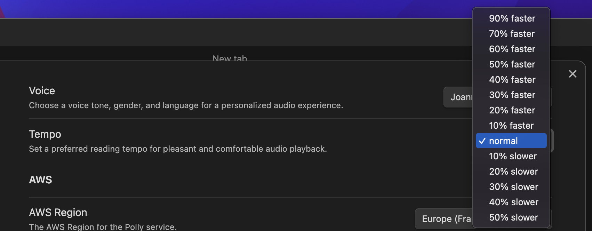

# Obsidian Voice Plugin 🔊

The Voice Plugin for Obsidian brings a new dimension to your note-taking by adding a voice feature directly to your workspace. It lets you listen to your written content with a mobile-friendly audiobook-like experience, offering a hands-free and convenient way to consume your notes and documents.

Whether you want to listen while multitasking, reinforce learning through auditory input, or simply enjoy a new way of engaging with your content, the Voice Plugin delivers a seamless and customizable text-to-speech solution within the Obsidian environment.

## Table of Contents

- [What This Plugin Can Do](#what-this-plugin-can-do)
- [Getting Started](#getting-started)
- [Setting Up Your AWS Account (Required)](#setting-up-your-aws-account-required)
  - [What You'll Need](#what-youll-need)
  - [Create a Safe Login for This Plugin](#create-a-safe-login-for-this-plugin)

## What This Plugin Can Do

- **Text-to-Speech**: The **Voice Plugin** leverages advanced text-to-speech technology to synthesize natural-sounding human speech, enabling your written content in Obsidian to be read aloud.
- **Private Communication**: Enjoy a completely private communication experience as the Voice Plugin utilizes your personal AWS account, ensuring you have full control over your data.
- **Voice Control**: Use the left **Voice** ribbon icon to easily start and stop the engaging audio, letting you dive into your notes whenever you choose.

  

- **Complete Status Bar Control Suite**: Take full command of your audio experience with our comprehensive status bar controls that put all essential functions at your fingertips. Navigate effortlessly through your content with dedicated rewind and fast-forward buttons to repeat or jump over sections, allowing you to focus on exactly the information you need. Watch your audio preparation unfold in real-time with an intelligent progress bar that shows exactly how your content is being synthesized, so you always know when your notes will be ready to play. Plus, enjoy real-time tempo adjustment directly from the status bar - no need to visit settings to change your listening speed.

  

- **Intelligent Error Feedback**: If something goes wrong (like network issues or AWS problems), you'll see red visual feedback, plus the interface automatically resets so you can try again immediately.

  

- **Voice Languages**: Select your preferred pronunciation style from 18 language options (American, British, German, French, Spanish, Italian, Polish, Dutch, Portuguese, Catalan, Swedish, Danish, Norwegian, Finnish, Japanese, Korean, Hindi and Mandarin).

  

- **Tempo Control**: Easily adjust the voice speed to suit your listening preference, ranging from a slow pace for relaxed understanding to a faster rate for quick information absorption, all while maintaining clear audio quality. Plus, you can now change the speed in real-time while audio is playing using the convenient status bar controls.

  

- **Content Selection**: By default, the **Voice Plugin** intelligently plays the entire text content within the file. In "Source mode", if you select the specific text you want to hear, then **Voice plugin** will speak only that selected text.
- **Voice Options**: Choose from a selection of 25 available voices to customize the reading experience to your preference.
- **AWS Polly Support**: Benefit from the power of AWS Polly, an advanced text-to-speech service that offers high-quality and human like voices.
- **AWS Account Integration**: Use your own AWS account credentials to utilize AWS Polly with the **Voice Plugin**.
- **Localisation**: Choose your preferred AWS Region to optimize performance and ensure the best experience with the **Voice Plugin**.

  

- **Mobile Support**: Seamlessly integrated into the mobile Obsidian application, it ensures you can enjoy a similar audio experience wherever you are. Works on iPhone and Android. Launch using the _Voice_ menue item.

  

- **Mobile Control Bar**: Dedicated mobile control bar provides easy access to essential playback functions, including play/pause, rewind, fast-forward, and tempo adjustment, all optimized for touch interaction. Progress bar shows the synthesis loading status.

  

- **Mobile Settings**: Access and customize key settings directly from the mobile interface, allowing you to tailor your listening experience on the go. With regional credentials validation and voice availability checking.

  

- **Caching**: Each speech is cached until new content will be submitted. Ensuring a seamless experience while keeping your expenses in check.
- **Hotkey**: Define your custom shortcuts to quickly _start_, _stop_, _pause_, _rewind_ or _fast-forward_ the voice synthesizer and adjust the reading _tempo_.

  

> **Note**: Just a heads up, when it comes to synthesizing large content files, give it a moment to work its magic. You'll know the Voice Plugin is hard at work when you see that refresh Ribbon Icon doing its magic thing. Once the processing is completed, that Ribbon Icon will switch things up and show off a pause icon. So sit back, relax, and let the Voice Plugin do its thing!

## Getting Started

1. Download and install the Voice Plugin for Obsidian.
2. Enable the Voice Plugin.
3. Open the Voice plugin settings and enter your personal AWS credentials and region.
4. Important: Close Obsidian and restart Obsidian.
5. Enjoy listening to your written content being read aloud.

> **Note**: No AWS Account? No problem! Get a free account on [aws.amazon.com](https://aws.amazon.com/) to get started with the Free Tier. With the Free Tier, you'll have access to 1 million characters per month for Neural voices or Speech Marks requests for the first 12 months, starting from your initial speech request.

> **Info**: The Voice Plugin is currently in beta, feedback is still appreciated. Keep in mind as in beta version, it may still have limitations. Your suggestions will help shape the future development of the Voice plugin, ensuring its continued improvement and refinement.

## Setting Up Your AWS Account (Required)

### What You'll Need

The Voice Plugin needs permission to use Amazon's text-to-speech service. Don't worry - we'll walk you through each step!

### Create a Safe Login for This Plugin

For your security, we recommend creating a separate login just for this plugin rather than using your main AWS credentials:

1. Log in to the AWS Management Console
2. Navigate to IAM (Identity and Access Management)
3. Select "Users" and click "Add user"
4. Choose a username (e.g., "obsidian-voice-plugin")
5. Select "Access key - Programmatic access" for Access type
6. On the permissions page, choose one of these options:

   **Option A: Use AWS Managed Policy (Easiest)**
   - Select "Attach existing policies directly"
   - Search for and select the "AmazonPollyReadOnlyAccess" AWS managed policy

   **Option B: Create Custom Policy (Most Secure)**
   - Select "Create policy"
   - Choose the JSON tab and paste the following:
     ```json
     {
       "Version": "2012-10-17",
       "Statement": [
         {
           "Effect": "Allow",
           "Action": ["polly:SynthesizeSpeech", "polly:DescribeVoices"],
           "Resource": "*"
         }
       ]
     }
     ```
   - Name the policy (e.g., "ObsidianVoiceMinimalAccess") and create it
   - Return to your user creation and attach this new custom policy

7. Complete the user creation process
8. Save the Access Key ID and Secret Access Key
9. Enter these credentials in the Obsidian Voice plugin settings
